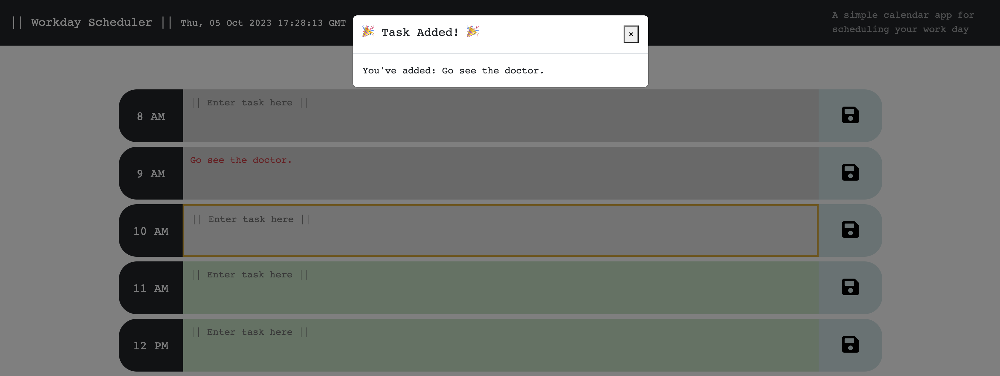

# Work Day Scheduler Starter Code

Developed a workday scheduling application utilizing Bootstrap, jQuery, and Day.js. This scheduler allows users to input tasks, which are then stored in the local storage upon clicking the "Save" button. Whenever a task is successfully added, a modal popup appears. Additionally, the application displays the current time, updating every second. To reset and clear the task list stored in local storage, a "Clear List" button is available for users to start over.

## Getting Started

Not Available

### Prerequisites

Not Available

### Installing

Not Available

### Code Snippet

Not Available

## Built With

* [HTML](https://developer.mozilla.org/en-US/docs/Web/HTML)
* [CSS](https://developer.mozilla.org/en-US/docs/Web/CSS)
* [JavaScript](https://www.javascript.com/)
* [Bootstrap](https://getbootstrap.com/)
* [jQuery](https://jquery.com/)
* [Day.js](https://day.js.org//)

## Deployed Link

* [See Live Site](https://eviehoang.github.io/work-day-scheduler/)

## Authors

* **NHI HOANG** 

- [Link to Portfolio Site](https://eviehoang.github.io/evie-portfolio/)
- [Link to Github](https://github.com/eviehoang)
- [Link to LinkedIn](https://www.linkedin.com/in/ynhihoang/)

See also the list of [contributors](https://github.com/your/project/contributors) who participated in this project.

## License

Not available at this time. 

## Acknowledgments

* Code base provided by Berkeley Bootcamp Team: Original Repository Source: [Github](https://github.com/coding-boot-camp/crispy-octo-meme).
* [W3School](w3schools.com/) for example codes to reference.
* [Bootstrap](https://getbootstrap.com/) for buttons, modal, layout, css resources.
* [jQuery](https://jquery.com/) for scripts.
* [Day.js](https://day.js.org//) for pulling date.
